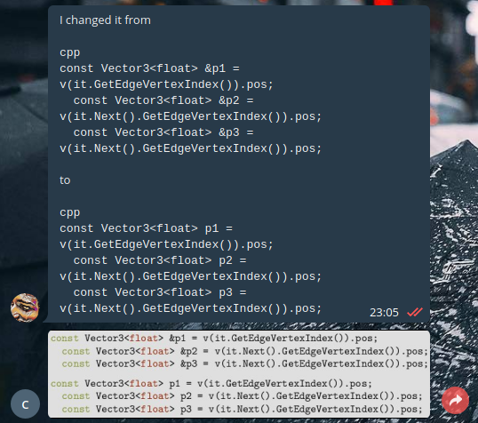

# Telegram code bot

A simple telegram bot that sends an image with syntax highlighting of any
code-snippet that is posted in the chat.



# Installation

This project is built in rust, so you will need the rust compiler as well as cargo.

Install imagemagick and pandoc for rendering markdown.

Set the enviroment variable `$TELEGRAM_BOT_TOKEN` to the bot token given to you by "bot father"

Initialise the submodule to get a modified telegram-api crate
```
git submodule init
git submodule update
```

Start the bot
```
cargo run
```

# Usage

Add the bot as an admin to your group.

Any code snippets in a message will be rendered to an image and sent to the chat.

Since it is rendered as markdown, you have to add the language after the first 3 backticks
on the snippet. For example:


    Look at this function I wrote!
    ```python
    def test():
        print("yolo")
    ```
